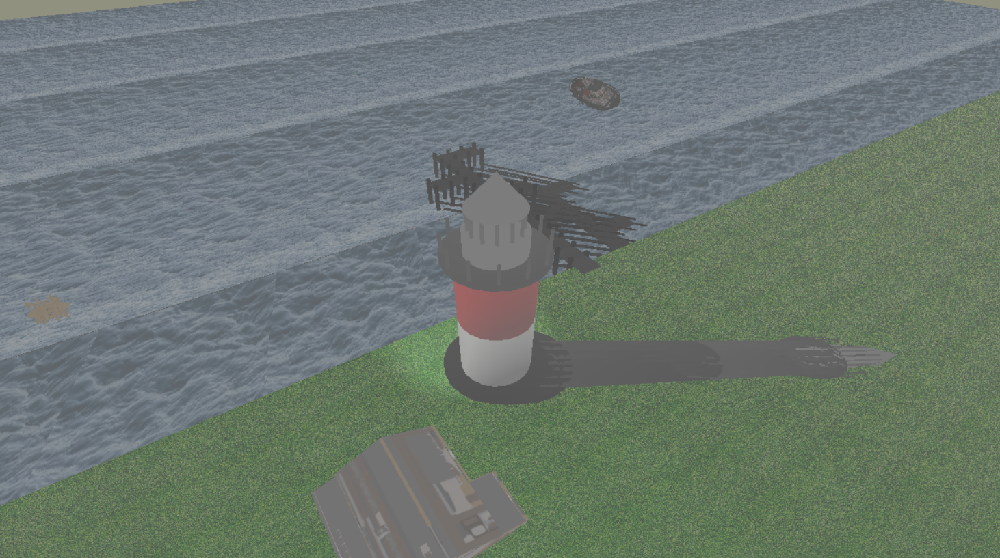
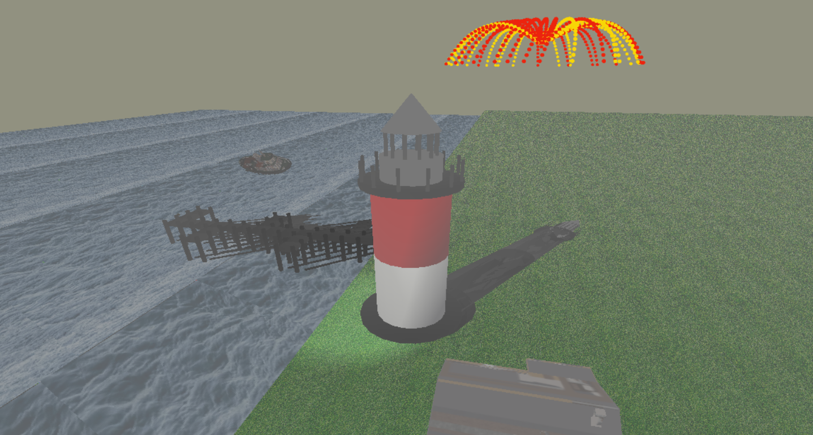
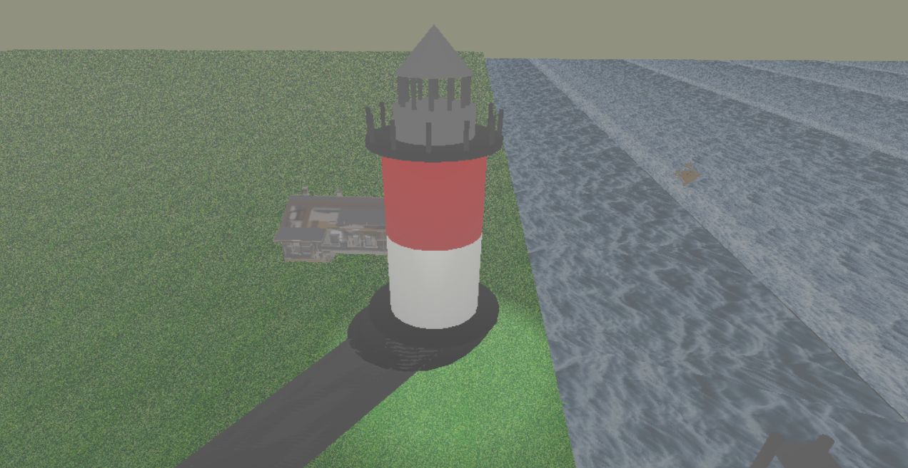

### The Lighthouse

>A 3D rendering of a view from the seashore

#### Implementation summary

- The lighthouse and the docks have been composed out of simpler objects which were represented as procedural surfaces, such as cylinders or cones.
- We implemented the Phong illumination model, as well as a fog effect, for a more realistic approach.
- The spotlight rotation uses quaternions, for a more compact representation.
- The fireworks are drawn on trajectories simulated using second-degree Bezier curves. A separate shader pipeline (which includes Tesselation and Geometry Shaders) has been created to manage the particle creation.

#### Snapshots

